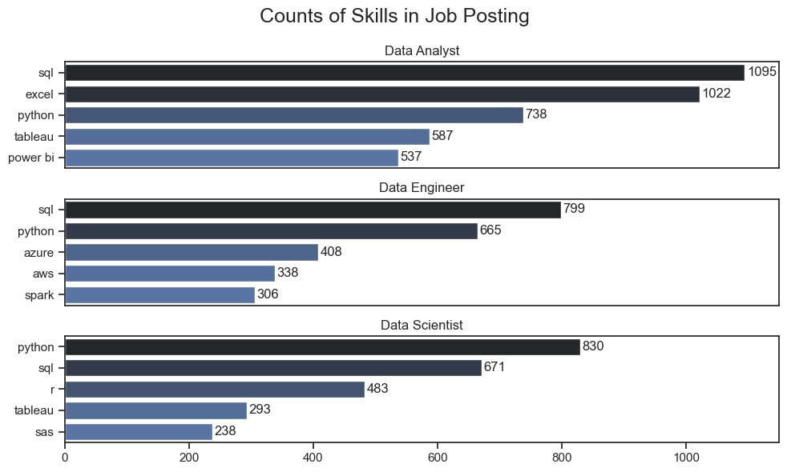
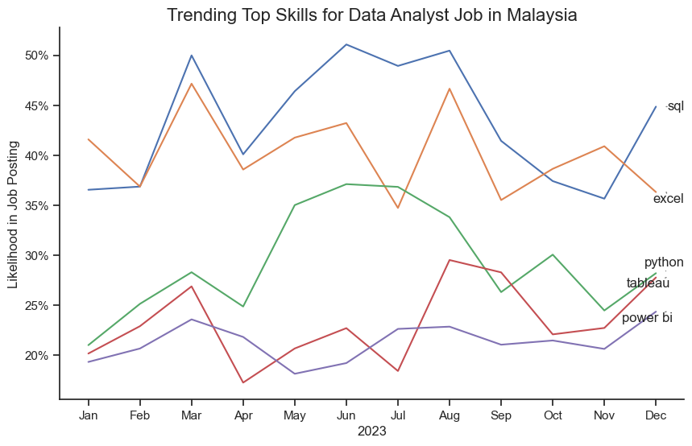
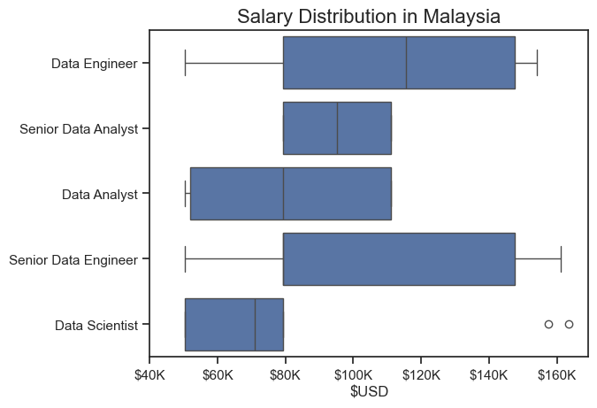
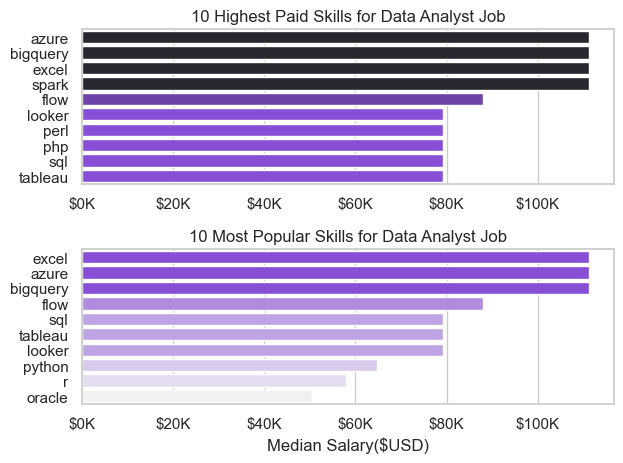
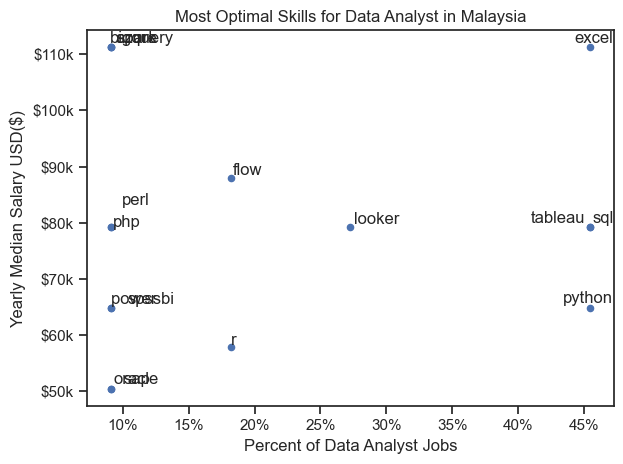

# Overview
This project analyzes job postings in Malaysia to uncover key insights about the data job market. The focus is on identifying the most in-demand skills, their trends over time, the salary distribution across roles, and the skills that provide the best balance between demand and compensation.

The dataset, sourced from [Luke Barousse's Python Course](https://huggingface.co/datasets/lukebarousse/data_jobs), serves as the foundation of this analysis. It contains detailed information on job titles, salaries, locations, and essential skills. Using a series of Python scripts, I explore key questions such as the most in-demand skills, salary trends, and the relationship between skill demand and compensation in the data analytics job market.

# The Question
Below are the question i want to answer in this project:
1. What are the most demanded skills for top 3 data roles in Malaysia?
2. How are in-demand skills trending for data analyst job in Malaysia?
3. How well do skills pays for data analyst roles in Malaysia?
4. What is the most optimal skills to learn for data analyst role in Malaysia?

# Tools I Used
This project was built using a combination of programming languages, libraries, and platforms for data analysis and visualization:
- **Python**: core programming language for data analysis, I also used the following Python libraries:
    - **Pandas and NumPy**: data cleaning, wrangling, and manipulation.
    - **Matplotlib and Seaborn**: data visualization and exploratory analysis.
- **Jupyter Notebook**: interactive development and documentation.
- **Visual Studio Code**: main IDE for coding and project management.
- **Git & GitHub**:version control and project portfolio showcase.

# The Analysis
## 1. What are the most demanded skills for top 3 data roles in Malaysia?
This project analyzes job postings data in Malaysia to identify the most in-demand skills for the top three data roles: Data Analyst, Data Engineer, and Data Scientist. The findings highlight both core technical requirements and role-specific expertise that companies are actively seeking.

Here's the detailed result and steps:
[2_Skills_Demand.ipynb](4_self_project\2_Skills_Demand.ipynb)

### Visualize Data
```
fig, ax = plt.subplots(len(job_titles), 1, figsize=(10, 6))

for i, job_title in enumerate(job_titles):
    df_plot = df_skills_count[df_skills_count['job_title_short'] == job_title].head(5)
    # df_plot.plot(kind='barh', x='job_skills', y='skill_count', ax=ax[i], title=job_title)
    sns.barplot(data=df_plot, x='skill_count', y='job_skills',
                ax=ax[i], hue='skill_count', palette='dark:b_r')
    ax[i].set_title(job_title)
    ax[i].set_ylabel('')
    ax[i].set_xlabel('')
    ax[i].legend().set_visible(False)
    ax[i].set_xlim(0, 1150)

    for n, v in enumerate(df_plot['skill_count']):
        ax[i].text(v + 3, n, v, va='center')
    
    if i != len(job_titles) - 1:
        ax[i].set_xticks([])

fig.suptitle('Counts of Skills in Job Posting', fontsize=18)
plt.tight_layout()
plt.show()
```

### Result



### Insight
- Data Analysts are expected to master SQL, Excel, and Python, with strong demand for data visualization tools like Tableau and Power BI.

- Data Engineers show high demand for SQL and Python, alongside cloud technologies such as Azure and AWS, and big data frameworks like Spark.

- Data Scientists emphasize Python, SQL, and R as core programming languages, with additional demand for statistical software (SAS) and visualization tools like Tableau.

- Overall, SQL and Python consistently appear across all roles, making them fundamental skills for anyone pursuing a career in data across Malaysia’s job market.

## 2. How are in-demand skills trending for data analyst job in Malaysia?

This chart illustrates the monthly trends of the top 5 most requested skills for Data Analyst roles in Malaysia during 2023. The visualization highlights the relative likelihood of each skill appearing in job postings, showing how demand fluctuates throughout the year.

Here's the detailed results and steps:
[3_Skills_Trends.ipynb](4_self_project\3_Skills_Trends.ipynb)

### Visualize Data
```
from adjustText import adjust_text
from matplotlib.ticker import PercentFormatter

df_plot = df_DA_MAS_percentage.iloc[:, :5]

plt.figure(figsize=(10,6))
sns.lineplot(data=df_plot, dashes=False, legend=False)
sns.set_theme(style='ticks')
sns.despine()

plt.title('Trending Top Skills for Data Analyst Job in Malaysia', fontsize=16)
plt.ylabel('Likelihood in Job Posting')
plt.xlabel('2023')

ax = plt.gca()
ax.yaxis.set_major_formatter(PercentFormatter(decimals=0))

texts = []
for i, col in enumerate(df_plot.columns):
    y = df_plot.iloc[-1, i]
    texts.append(plt.text(11.2, y, col, va='center'))

adjust_text(texts, arrowprops=dict(arrowstyle="-", color='gray'))

plt.show()
```

### Result


### Insight
- SQL and Excel consistently dominate the skill requirements, with SQL slightly leading. Their high demand underscores their position as the backbone of data analysis work.
- Python shows steady growth and remains a strong complementary skill to SQL and Excel, reflecting the increasing adoption of programming for data analysis and automation.
- Tableau and Power BI, both visualization tools, maintain a stable but lower demand compared to SQL, Excel, and Python. This suggests that while visualization skills are valued, they are typically considered secondary to core analysis and programming skills.
- Seasonal variations in demand indicate possible hiring cycles, with peaks in March–June and August, before a slight decline toward the end of the year.

## 3. How well do jobs pays for popular data roles in Malaysia?
The boxplot illustrates the salary distribution of data-related roles in Malaysia across five positions: Data Engineer, Senior Data Analyst, Data Analyst, Senior Data Engineer, and Data Scientist. Salaries are represented in USD ($).

Here's the detailed result and steps:
[4_Salary_Analysis.ipynb](4_self_project\4_Salary_Analysis.ipynb)

### Visualize Data
```
sns.boxplot(data=df_MAS_top5, x='salary_year_avg', y='job_title_short', order=df_order)
sns.set_theme(style='ticks')

plt.title('Salary Distribution in Malaysia', fontsize=16)
plt.ylabel('')
plt.xlabel('$USD')
plt.xlim(40000,)

ticks_x = plt.FuncFormatter(lambda y, pos: f'${int(y/1000)}K')
plt.gca().xaxis.set_major_formatter(ticks_x)

plt.show()
```

### Result 


### Insight
- Senior Data Engineer earns the highest salaries, with a wide range up to ~$160K, showing strong demand for advanced engineering skills.
- Data Engineer also has high and consistent pay, generally between $80K–$150K, making it one of the most lucrative roles.
- Senior Data Analyst salaries are concentrated between $80K–$115K, indicating stability but limited growth compared to engineering roles.
- Data Analyst has the lowest starting salary (~$45K), with a median around $80K–$90K, typical for entry-level positions.
- Data Scientist salaries are modest ($55K–$85K) for most, but with a few outliers above $150K, reflecting niche or senior expertise.
- Overall, data engineering roles (engineer & senior engineer) show higher earning potential than data analyst and data scientist roles in Malaysia.

## 3. How well do skills pays for data analyst roles in Malaysia?
This chart shows the top 10 highest-paid and most popular skills for Data Analyst roles in Malaysia. The analysis is based on limited available data, as many entries for annual salary averages were missing.

Here's the detailed result and steps:
[4_Salary_Analysis.ipynb](4_self_project\4_Salary_Analysis.ipynb)

### Visualize Data
```
fig, ax = plt.subplots(2, 1)

sns.set_theme(style='whitegrid')
sns.barplot(data=df_DA_MAS_top_pay, x='median', y=df_DA_MAS_top_pay.index, ax=ax[0], hue='median', palette='dark:#8338ec_r', legend=False)
ax[0].set_title('10 Highest Paid Skills for Data Analyst Job')
ax[0].set_ylabel('')
ax[0].set_xlabel('')
ax[0].xaxis.set_major_formatter(plt.FuncFormatter(lambda x, pos: f'${int(x/1000)}K'))

sns.barplot(data=df_DA_MAS_top_skills, x='median', y=df_DA_MAS_top_skills.index, ax=ax[1], hue='median', palette='light:#8338ec', legend=False)
ax[1].set_title('10 Most Popular Skills for Data Analyst Job')
ax[1].set_ylabel('')
ax[1].set_xlabel('Median Salary($USD)')
ax[1].set_xlim(ax[0].get_xlim())
ax[1].xaxis.set_major_formatter(plt.FuncFormatter(lambda x, pos: f'${int(x/1000)}K'))

plt.tight_layout()
plt.show()
```

### Result


### Insight
- Azure, BigQuery, and Excel stand out as both high-paying and highly demanded skills for Data Analysts in Malaysia.
- Big data (Spark, Flow) and visualization tools (Tableau, Looker) show strong relevance, though with varied salary vs popularity balance.
- ⚠️ Insights are limited since many salary records are missing, so results should be interpreted cautiously.

## 4. What is the most optimal skills to learn for data analyst role in Malaysia?
The chart shows the relationship between the popularity of data analyst skills (measured by percentage of job postings) and their corresponding median yearly salary in Malaysia.

Here's the detailed result and steps:
[5_Optimal_Skills.ipynb](4_self_project\5_Optimal_Skills.ipynb)

### Visualize Data
```
from adjustText import adjust_text
from matplotlib.ticker import PercentFormatter

df_DA_MAS_skills_high_demand.plot(kind='scatter', x='skill_percent', y='median_salary')

texts = []
for i, txt in enumerate(df_DA_MAS_skills_high_demand.index):
    texts.append(plt.text(df_DA_MAS_skills_high_demand['skill_percent'].iloc[i], df_DA_MAS_skills_high_demand['median_salary'].iloc[i], txt))
adjust_text(texts)

x = df_DA_MAS_skills_high_demand['skill_percent'].iloc[i]
y = df_DA_MAS_skills_high_demand['median_salary'].iloc[i]

ax = plt.gca()
ax.yaxis.set_major_formatter(plt.FuncFormatter(lambda y, pos: f'${int(y/1000)}k'))
ax.xaxis.set_major_formatter(PercentFormatter(decimals=0))

plt.xlabel('Percent of Data Analyst Jobs')
plt.ylabel('Yearly Median Salary USD($)')
plt.title('Most Optimal Skills for Data Analyst in Malaysia')
plt.tight_layout()
plt.show()
```

### Result


### Insight
- Excel dominates both in demand and salary, making it the most strategic skill for aspiring data analysts in Malaysia.
- Cloud and big data tools (Azure, BigQuery, Spark) command the highest salaries, though they appear in fewer job postings.
- Programming languages (Python, SQL) are among the most requested skills, but their salaries are moderate compared to niche technologies.


# Overall Insight
- SQL, Excel, and Python consistently emerge as the most in-demand skills for Data Analysts in Malaysia, forming the core technical foundation.
- Cloud and big data tools (Azure, BigQuery, Spark) offer the highest salary potential, though they appear less frequently in job postings.
- Data Engineers generally command higher salaries than Data Analysts and Data Scientists, reflecting strong market demand for data infrastructure expertise.

# Challanges I Faced
- **Incomplete and missing data**: many salary fields were empty, which limited the accuracy of salary-based insights.
- **Data cleaning complexity**: handling inconsistent formats in job titles, locations, and skills required careful preprocessing.
- **Visualization clarity**: ensuring that charts (especially scatter plots with many labels) were clear and readable required experimenting with libraries like adjustText and custom formatting.

# Conlusion
This project highlights the dynamics of Malaysia’s data job market, showing that core skills such as SQL, Excel, and Python remain essential for Data Analysts, while cloud and big data tools like Azure and BigQuery provide opportunities for higher salaries despite lower demand. The findings also reveal that Data Engineers generally enjoy higher earning potential compared to other roles, reflecting the growing importance of data infrastructure. Although limited by incomplete salary data, the analysis provides practical guidance for aspiring data professionals to prioritize skill development and align with market needs
